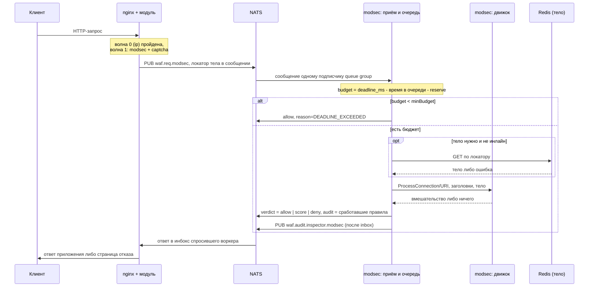

# Инспектор modsec

Референсный инспектор правил: получает сообщение с шины, при необходимости достаёт тело из
внешнего хранилища, прогоняет запрос через движок SecLang (ModSecurity/Coraza) и отвечает
вердиктом по протоколу `docs/verdict-protocol.md`. Это узел «Инспектор
правил» на схеме компонентов в `docs/architecture.md` и замена
заглушки `sqli` из примеров конфигурации.

> **Статус.** Фаза запроса работает: движок — Coraza со встроенным CRS 4, профили `default` и
> `strict`, вердикты `allow`/`score`/`deny`, admission control, проба-healthcheck. Инспектор поднят в
> локальном окружении ../../deploy (`deploy`) и проверяется прогоном
> `tests/modsec` (`docs/tests/modsec/README.md`), см. [«Запуск»](#запуск).
>
> Тело работает целиком: инлайн, префикс и получение по локатору из Redis
> ([`internal/body/`](internal/body/README.md)) — модуль присылает настоящий локатор с этапа 6, и путь
> проверяется прогоном `tests/body` (`docs/tests/body/README.md`) инъекцией крупнее порога инлайна.
>
> Фаза ответа работает в обоих видах: липкая транзакция (`keep=on` на запросе, `resume=` на ответе
> — фазы 3–4 доигрываются на живой транзакции того же экземпляра) и откат с восстановлением с нуля
> по `request_store`. Что делать, когда состояние потеряно, решает маршрут: `prefer` переигрывает,
> `require` отказывает.
>
> Фаза кадров (`phase: frame`, WebSocket от клиента) работает первой итерацией: кадр судится
> синтетической транзакцией — POST на адрес рукопожатия с заголовками рукопожатия из `request_store`
> и телом `application/x-www-form-urlencoded` из одного аргумента `frame=<полезная нагрузка>`, так
> что CRS видит содержимое кадра в `ARGS_POST:frame` (`cmd/modsec/frame.go`). Двоичные кадры
> пропускаются с кодом `MODSEC_FRAME_BINARY`, JSON по полям не раскладывается, состояния по
> соединению нет. Проверяется тестом `internal/rules/frame_test.go` (сообщение чата — ноль очков,
> инъекция — порог) и прогоном [nginx/tests/ws](https://github.com/exemt/placitum-node/blob/develop/docs/tests/websocket.md).
>
> Не сделано: калибровка счёта по своему трафику (формула существует, но её коэффициент подобран из
> общих соображений, а не измерен) и раздача профилей фазы ответа через KV — `internal/desired/`
> пока возит только `request/`.

## Идея одним абзацем

Инспектор подписан на `waf.req.modsec` в своей queue group. На каждое сообщение: разобрать запрос
инспекции → если волне нужно тело и оно не пришло инлайном, получить его по локатору (в первую
очередь из Redis — см. [«Тело»](#тело)) → создать транзакцию движка правил и прогнать её через
фазы, доступные в пределах одного сообщения → преобразовать вмешательство движка в вердикт протокола
и калиброванный `score` → ответить в `reply-to`. Дальше в этом документе — почему именно так и что
из этого уже решено, а что нет.

Развёрнутое обоснование каждого шага — в
`docs/research/modsecurity-inspector.md`. Этот README
не повторяет его, а фиксирует, как разбор из research превращается в код: карта каталогов, границы
между частями и то, что каждая часть обязана и не обязана делать.

## Поток сообщений



Этот поток — частный случай общей схемы из
`docs/inspectors.md`; отличие modsec от остальных инспекторов не
в транспорте, а в том, что внутри одного сообщения выполняется несколько фаз движка правил и что
получение тела — не опция, а типичный путь (движок раскрывается на теле, см.
[«Тело»](#тело)). Событие аудита уходит после inbox: сырые CRS scores и `matched`
живут там, модуль поле `audit` не хранит. Join с итогом запроса — `node` + `rid`,
см. `docs/audit.md`.

## Где инспектор в конвейере

Не в волне 0 — туда пускают только дешёвый IP фильтр. `modsec` стоит на следующей волне
и опрашивается параллельно с другими инспекторами той же волны:

```nginx
waf_inspector ip     subject=waf.req.ip;
waf_inspector captcha subject=waf.req.captcha;
waf_inspector modsec subject=waf.req.modsec profile=strict;

location /api/ {
    waf_inspect ip      wave=0 timeout=5ms;
    waf_inspect captcha wave=1 timeout=10ms;
    waf_inspect modsec  wave=1 timeout=25ms;
    waf_capture            request headers args body;
    waf_body_limit         256k;
    waf_deadline           40ms;
    proxy_pass http://api;
}
```

Подробности — почему не штатный коннектор nginx, почему не волна 0, что происходит с ICAP на более
поздней волне — в
modsecurity-inspector.md#где-инспектор-встаёт-в-конвейер (`docs/research/modsecurity-inspector.md`).

## Главное ограничение: stateless-вызов вместо транзакции

ModSecurity/Coraza спроектированы как машина состояний над одной транзакцией из пяти фаз, а контракт
инспектора требует stateless-обработки одного сообщения
(inspectors.md#контракт (`docs/inspectors.md`)). Для фазы запроса конфликта нет — одно
сообщение содержит всё нужное для фаз 1–2. Фазы 3–4 — продолжение той же транзакции, и разрешается
это **липкостью**, а не пересборкой.

**Основной путь.** Маршрут с `keep=on` на `waf_inspect` фазы запроса
(`docs/directives/list/inspect.md`) присылает в сообщении этой фазы признак
`resume.want` и ключ. Инспектор оставляет транзакцию открытой, кладёт её в реестр
([`internal/sticky`](internal/sticky/README.md)) и возвращает в вердикте `continue`: личный subject
своего экземпляра и срок. Без `want` транзакция выбрасывается вместе с ответом — держать её на
каждом запросе значило бы платить памятью за маршруты, которым липкость не нужна. Маршрут с
`resume=` на фазе ответа получает публикацию в этот subject с тем же ключом; инспектор достаёт
транзакцию и доигрывает фазы 3–4 поверх настоящего состояния фаз 1–2. Контекст запроса, входящий
счёт и корреляция `RESPONSE-980-CORRELATION` при этом настоящие, а не восстановленные.

**Откат.** Обещание отзывается в любой момент: экземпляр мог умереть, реестр — переполниться, срок —
истечь. Тогда сообщение приходит в групповой subject — с тем же ключом и с `require` маршрута, — и
дальше решает `require`. `resume=prefer` (`require:false`): транзакция строится с нуля, фазы 1–2
прогоняются заново по `conn`, `http` и `request_store`. `resume=require` (`require:true`): отказ
`MODSEC_RESUME_LOST`, находка `modsec-resume-lost` в аудите и `error` в логе — на живом контуре так
быть не должно, и причину (реестр, срок, экземпляр) надо искать. Маршрут без `resume=` вовсе
секции не получает и инициализируется заново молча.

Не ради их находок — их уже нашёл инспектор фазы запроса. Ради двух других вещей. Первая:
инициализация CRS (`REQUEST-901`) — это правила фазы 1, они выставляют уровни паранойи, веса severity
и пороги, и без их прогона `RESPONSE-*` складывают нераскрытые макросы вместо весов. Вторая: контекст
запроса для правил, которые на него смотрят, — у стокового CRS 4 таких среди `RESPONSE-*` нет ни
одного (они читают только `RESPONSE_BODY`, `RESPONSE_HEADERS`, `RESPONSE_STATUS` и `TX:*`), но
локальные правила маршрута и корреляция входящего счёта с исходящим читают именно его.

Цена отката: тела запроса в сообщении фазы ответа нет, поэтому `ARGS_POST` и `REQUEST_BODY` у
переигранной транзакции пусты, а входящий счёт пересчитан без них. В аудите и в логе оба пути
различимы полем `resumed`.

Отчитывается каждая сторона за свои фазы: вердикт запроса несёт находки фаз 1–2, вердикт ответа —
фаз 3–4 (`matchedPhases`). Фаза 5 не отчитывается вовсе: её правила — сводка счёта, а не находки.

## Запуск

Инспектор входит в локальное окружение ../../deploy (`deploy`) сервисом `inspector-modsec` и
поднимается вместе с остальным:

```sh
cd deploy
docker compose up -d --wait
docker compose exec -T nginx-1 sh /t/modsec/modsec.sh
```

Маршруты `/modsec*` в `deploy/nginx/nginx.conf` заведены только под
него: тестовых инспекторов на них нет, поэтому и код ответа, и счёт целиком определяются CRS.
Порог там `waf_score_deny 50` — при действующей калибровке это ровно порог самого CRS, то есть
модуль блокирует там же, где заблокировал бы стоковый набор правил:

```sh
curl -i "localhost:8080/modsec/?id=1'+or+1=1--"          # 403, deny по порогу счёта
curl -i "localhost:8080/modsec-strict/?id=1'+or+1=1--"   # то же, но уровень паранойи 2
curl -i "localhost:8080/modsec-passive/?id=1'+or+1=1--"  # 200: вердикт есть, влияния нет
curl -i "localhost:8080/modsec-deny/"                    # 403 на любой запрос: фикстура
curl -i "localhost:8080/modsec-allow/?id=1'+or+1=1--"    # 200 на любой запрос: фикстура
```

Последние два маршрута ведут на профили-фикстуры `deny` и `allow`, ответ которых не зависит от
запроса. Они проверяют не детект, а то, что тег профиля с маршрута доехал до инспектора и что
вердикт применён, — и потому не ломаются от обновления CRS. Подробнее — в
[`profiles/`](profiles/README.md).

Отдельно от модуля инспектор проверяется пробой — тем же путём через шину, что и настоящий запрос,
поэтому она же служит healthcheck контейнера:

```sh
docker compose exec inspector-modsec modsec-probe --uri "/?id=1%27+or+1%3D1--"
docker compose exec inspector-modsec modsec-probe --uri "/x" --profile strict --expect allow
```

Профили монтируются с диска как bootstrap: правка плюс `docker compose restart inspector-modsec`
перечитывает их целиком (и отказывается стартовать, если набор не компилируется, — это намеренно,
см. [`internal/rules/`](internal/rules/README.md)). Боевая раскатка с контроллера — `send` в
JetStream KV, инспектор сам компилирует и подменяет набор, см.
`docs/inspector-config-distribution.md`.

## Карта каталогов

| Путь | Назначение | Этап roadmap | Подробности |
| --- | --- | --- | --- |
| [`cmd/modsec/`](cmd/modsec/README.md) | Точка входа: конфигурация, подписка, дренаж по сигналу | 4 | — |
| [`internal/config/`](internal/config/README.md) | Переменные окружения, дефолты | 4 | — |
| [`internal/protocol/`](internal/protocol/README.md) | Типы запроса/ответа, разбор, версия схемы | 4 | `docs/verdict-protocol.md` |
| [`internal/queue/`](internal/queue/README.md) | Admission control: очередь ограниченной глубины, проверка бюджета | 4 | [«Дедлайн»](#дедлайн-и-admission-control) |
| [`internal/engine/`](internal/engine/README.md) | Интерфейс движка правил, независимый от реализации | 4 | [«Движок правил»](#движок-правил) |
| [`internal/engine/coraza/`](internal/engine/coraza/README.md) | Реализация интерфейса на Coraza | 4 | `docs/research/seclang-engines.md` |
| [`internal/body/`](internal/body/README.md) | Получение тела по локатору: inline, redis, недоступность, расшифровка | 6 | [«Тело»](#тело) |
| [`internal/verdict/`](internal/verdict/README.md) | Вмешательство движка → вердикт протокола, калибровка `score` | 4 | [«Вердикт и калибровка счёта»](#вердикт-и-калибровка-счёта) |
| [`internal/audit/`](internal/audit/README.md) | `kind=inspector` в `WAF_AUDIT` после ответа в inbox | 8 | `docs/audit.md` |
| [`internal/rules/`](internal/rules/README.md) | Выбор профиля по маршруту, атомарная подмена набора правил | 4/6 | [«Профили правил»](#профили-правил) |
| [`internal/sticky/`](internal/sticky/README.md) | Реестр живых транзакций между фазами одного запроса | 7 | [«Главное ограничение»](#главное-ограничение-stateless-вызов-вместо-транзакции) |
| [`profiles/http/`](profiles/http/README.md) | CRS и локальные правила: фазы 1-5, обе стороны | 4/7 | [«Профили правил»](#профили-правил) |
| [`deploy/`](deploy/README.md) | Dockerfile, healthcheck, интеграция в ../../deploy (`deploy`) | 6 | — |
| [`test/`](test/README.md) | Интеграционные фикстуры и замеры латентности по классам нагрузки | 4/6 | «Что надо померить» (`docs/research/modsecurity-inspector.md`) |

Модульные тесты Go-кода лежат рядом с исходниками (`_test.go`), по конвенции языка; `test/` — только
то, что не привязано к одному пакету.

## Движок правил

Отображение сообщения на API движка не зависит от реализации — оба кандидата дают одну и ту же
последовательность вызовов (`conn` → `ProcessConnection`; `http.uri`+`http.method` → `ProcessURI`;
`http.headers` → `AddRequestHeader`* → `ProcessRequestHeaders`; тело → `WriteRequestBody` →
`ProcessRequestBody`). Это позволяет спрятать движок за одним внутренним интерфейсом на пять фаз и
не привязываться к выбору из
`docs/research/seclang-engines.md` заранее. Рекомендация
исследования — начинать с Coraza (без катастрофического бэктрекинга, безопасность памяти, тот же
язык, что у остального референсного скелета из
docs/inspectors.md#скелет-инспектора (`docs/inspectors.md`)), поэтому
`internal/engine/coraza/` — единственная реализация в плане на старте; каталог для второй
(libmodsecurity через cgo) не создаётся заранее, чтобы не фиксировать решение, которое ещё не
принято.

## Тело

Тело — основная ценность движка: правила по URI и заголовкам ловят часть находок, разбор аргументов
и содержимого — остальное. Из этого для реализации следует:

- **Content-Type решает всё.** Заголовки в сообщении уже есть, разбор multipart/urlencoded/JSON/XML —
  дело движка, не инспектора.
- **Усечённое тело не проверяется.** Префикс JSON или XML обрывается посреди значения и документом
  быть перестаёт: движок выставил бы `REQBODY_ERROR`, `ARGS` остались бы пустыми, и правила по
  содержимому промолчали бы даже о признаке, целиком попавшем в префикс, — а запрос ушёл бы `allow`,
  неотличимый от чистого. Поэтому на `truncated: true` движок не запускается вовсе: ответ —
  `verdict: "error"` с кодом `MODSEC_BODY_TRUNCATED` и `engine.body = "truncated"` в аудите, исход
  выбирает `waf_exception … inspector` маршрута. Инспектор объявляется с `body=full`; маршрут с
  `waf_body_limit ... trim` или срезом снимка получает от него не проверку, а честный отказ от неё.
  Прогон — tests/audit/truncate.sh (`tests/audit/truncate.sh`).
- **Порядок драйверов.** Внешний драйвер — `redis`
  (body-storage.md#redis (`docs/body-storage.md`)).
- **Недоступное тело — не решение инспектора, но и не проверка.** `{"unavailable": "..."}` в
  локаторе и собственный сбой получения (обменник не ответил, не расшифровалось, не сошёлся `sha256`)
  кончаются одинаково: `verdict: "error"` с кодом `MODSEC_BODY_UNAVAILABLE`, причина — в
  `engine.body` записи аудита. Пропустить или отказать, говорит `waf_exception … inspector`
  маршрута. См. docs/inspectors.md#получение-тела (`docs/inspectors.md`).
- **Шифрование.** При `waf_body_encrypt on` ключ приходит из своей системы секретов по `kid` из
  локатора, не с провода. `sha256`/`processed_sha256` после расшифровки — заодно ключ кеша вердикта
  по содержимому.

## Профили правил

Набор один на всю транзакцию HTTP — фазы 1–5, обе стороны, — потому что транзакция и есть одна:
продолжение доигрывает фазы 3–4 поверх состояния фаз 1–2, а откат переигрывает 1–2 тем же набором.
Именованных профилей внутри набора может быть сколько угодно, по подпапке на профиль (`default`,
`strict`, фикстуры `allow` и `deny`):

| Что выключено | Почему |
| --- | --- |
| Persistent collections, `REQUEST-912` (DoS) | Их работу делает локальный слой (`waf_local_rate`, IP фильтр), и он делает её раньше — до публикации на шину |
| Блокировка движком: `SecRuleEngine DetectionOnly` | Порог применяет модуль по `waf_score_deny` своей фазы; расхождение видно в аудите как `crs_would_block` |

Больше не выключено ничего, и это разница с прежней раскладкой: `RESPONSE-980-CORRELATION` работает,
потому что входящий и исходящий счёт теперь в одной транзакции. Синтетического заголовка
`x-waf-inbound-score` тоже больше нет — счёт своей стороны транзакция считает сама.

Подмена набора правил — атомарная замена указателя, набор собирается целиком, проверяется и
подставляется; старый набор доживает до завершения текущих транзакций
(modsecurity-inspector.md#правила-и-их-жизненный-цикл (`docs/research/modsecurity-inspector.md`)).

**Выбор профиля — по явному тегу, а не по угадыванию маршрута.** Секция `route` в сообщении несёт
поле `profile` — имя, которое nginx подставил из `profile=` записи реестра
(`docs/directives/list/inspector.md`), для данного вызова.
Это профиль на маршрут, а не инспектор на маршрут, и модуль nginx передаёт значение как непрозрачную
строку — он не знает, какие профили существуют внутри инспектора, и не проверяет это при `nginx -t`.
Инспектор больше не парсит `route.server_name`/`route.location` и не держит у себя копию карты
маршрутов nginx — это дублирование конфигурации в двух местах, которого явный тег и избегает.

Ответственность за сам тег — на инспекторе:

- Профиль не найден среди загруженных подкаталогов `profiles/http/<profile>/` — ответ
  `verdict: error` с `MODSEC_UNKNOWN_PROFILE`. Ни отката на `profiles/http/default/`, ни отказа:
  чужой набор правил — это проверка не того, а блокировка была бы отказом за чужую ошибку
  развёртывания. Что делать с запросом, решает `waf_exception <фаза> inspector pass|deny` маршрута.
- Каждое такое расхождение считается отдельным счётчиком метрик — это сигнал, что конфигурация nginx
  и набор загруженных профилей инспектора разошлись (опечатка в `profile=` реестра, не
  выложенный вместе с конфигом каталог профиля), и без счётчика оно осталось бы незаметным до жалобы.
- `profiles/http/default/` обязателен и проверяется при старте процесса: это профиль маршрутов
  без явного `profile=`, и его отсутствие — ошибка старта, а не находка в конфигурации маршрута.

## Просьбы соседей (prior)

Канал действий (`docs/inspector-actions.md`): сосед по `prior` может
попросить сдвинуть внутренний порог аномалии (`threshold`) или не проверять этот запрос (`skip`).
Просьба — не команда: без правила приёма она не значит ничего, и правила приёма — единственное
место, где она что-то значит.

Правила лежат в `profiles/http/<профиль>/policy.yaml`, рядом с `*.conf` того же профиля, по образцу
секции `trigger.prior` капчи (прежнее имя `prior.yaml` читается одно поколение):

```yaml
prior:
  - from: ip                # имя отправителя; "*" не принимается: оба глагола ослабляют
    accept: [threshold]     # threshold | skip — остальное modsec не применяет
    codes: [IP_ALLOWLIST]   # пусто — любой повод
```

Чисел в правиле нет: потолок `max_percent` (и прежнее `max_delta`) умер, ключи читаются и
игнорируются одно поколение — величину просьбы держит загрузчик отправителя.

Файла нет — профиль никого не слушает, и это обычное состояние, а не незаполненная форма. Файл с
опечаткой роняет загрузку набора целиком, как опечатка в SecLang: правило, которое молча не
грузится, — дыра, а не умолчание.

Раскатка из панели файл возит: в паке у политики свой слот `policies`, и при раскладке дерева она
ложится в каталог своего профиля ([ниже](#как-политика-доезжает-до-ноды)). Это важно потому, что
применённое дерево (`WAF_MODSEC_DATA`) подменяет каталог профилей целиком: файл из образа после
первой отправки правил перестал бы действовать, и правила приёма молча выключились бы.

Применение:

- `threshold` — коэффициент к счёту, который инспектор отдаёт модулю на этом запросе и только на
  нём: `delta` — проценты, множитель `1 + delta/100`. Минус — скидка (намерял на 50, с `-50`
  отдал 25), плюс — поведение клиента дороже. Ни внутренний порог аномалии, ни порог маршрута
  `waf_score_deny` не двигаются: модуль видит обычный вердикт обычного инспектора, просто вклад
  стоит иначе. Просьба берётся целиком; проценты нескольких принятых просьб складываются, сумма
  прижата к −100…+900. В `kind=inspector` едет тройка `score_raw` / `score_scale_percent` /
  `score_scaled`.
- `skip` снимает проверку целиком: `allow` с кодом `MODSEC_SKIPPED`, движок не запускается,
  транзакция не паркуется. Секция `prior` сквозная по фазам, поэтому на фазе ответа та же просьба
  приезжает снова, и фаза ответа пропускается тоже — раньше, чем `resume=require` успел бы
  отказать за потерянное состояние.

Исход каждой доставленной просьбы — в событии `kind=inspector`, `engine.actions`: `applied` (в
`took` — сколько взято) либо `no_rule` — доставлено, но инспектор этого отправителя не слушает. При ненулевой дельте там же пишется
`crs_threshold_effective` — порог, с которым инспектор в итоге работал: в записи виден сырой
`crs_anomaly_score` и виден `score`, и без действующего знаменателя одно из другого не вывести.

## Инициаторы по исходу

Приём — половина канала; вторая в том, что инспектор **сам говорит соседям**. Форма та же, что у
ip (`docs/inspectors/ip/README.md`) и json (`docs/inspectors/json/README.md`): «когда → что сделать», где «когда» — собственный
решённый исход, а не повторение его предпосылок.

```yaml
# profiles/http/<профиль>/policy.yaml, рядом с правилами приёма
outcomes:
  - on: score                 # deny | allow | score | overload
    at: 30                    # порог: счёт, который уходит модулю, >= 30
    to: captcha
    do: challenge
    code: MODSEC_SUSPECT
  - on: score
    at: 5
    below: true               # сравнение в другую сторону: счёт < 5
    to: vlai
    do: skip
  - on: deny
    list: api_abusers         # запись субъекта в живой набор
    write: net                # addr | net | net_all | asn -- кого именно писать
    ttl: 1h
  - on: overload              # запрос снят на входе: очередь была полна
    list: shed_clients
    ttl: 10m
```

Четыре триггера — три собственных вердикта этой фазы и снятие на входе:

| `on` | Когда срабатывает |
| --- | --- |
| `deny` | движок вмешался: отказ или редирект |
| `allow` | запрос прошёл, в том числе с нулевым счётом |
| `score` | вердикт `score`, и счёт прошёл сравнение: `>= at`, либо `< at` при `below: true` |
| `overload` | запрос снят из-за полной очереди (`MODSEC_QUEUE_LIMIT`): оценка не начиналась |

`overload` не дёргается на протухшем бюджете (`MODSEC_DEADLINE_EXCEEDED`): дедлайн бывает и у
короткой волны, и банить клиента за латентность контура было бы баном ни за что. Это ровно та
развязка, ради которой триггер заведён: под перегрузкой дешевле снять горячих клиентов записью в
набор — дальше их режет локальный слой на краю, не грея очередь, — чем гнать весь трафик через
`wait` и дедлайны. Запись публикует сам инспектор, мимо ответа; просьба соседям на этом пути тоже
доезжает — ответ снятия мгновенный.

Сравнивается тот счёт, который **уходит модулю**, — то есть уже с коэффициентом `threshold` соседа,
если он был. Иначе получилось бы, что оператор смотрит на одно число, а сосед двигает другое.

Действие ровно одно из двух:

- **просьба соседу** — `to` + `do` (+ `apply`, `delta`, `value`, `code`): та же форма, что у любого
  отправителя канала, те же пределы, тот же аудит. Просьбы на `on: deny` не бывает — отказ обрывает
  фазу, и волн, которым она адресована, уже не будет;
- **запись в живой набор** — `list` + `write` + `ttl` (+ `code`): субъект уезжает в набор
  локального слоя, и дальше его режет модуль на краю — до шины и до инспекторов.

**Тумблера «наблюдение» у инициаторов нет.** Профильного режима у modsec никогда не было, а
теперь его нет ни у кого: пассивность — свойство маршрута (`waf_inspect … mode=passive`), и держит
её модуль — записи
пассивного в `prior` нет вовсе
(«Пассивного в prior нет» (`docs/inspector-actions.md`)). Второй
выключатель того же самого здесь означал бы два места, которые разъедутся.

### Кого писать: адрес, подсеть, автономная система

`write` называет **субъекта**, а не формат строки. Видов четыре, и они одни на всех, кто пишет в
наборы: капча (`docs/inspectors/captcha/README.md`), json, счётчик, vlai, калитка,
профиль адреса и автодействия понимают их одинаково.

| `write` | Что уезжает в набор | Откуда берётся |
| --- | --- | --- |
| `addr` | адрес клиента | из сообщения (`conn.client_ip`) |
| `net` | эффективный анонс — самый узкий из тех, что накрывают адрес | кодер гео контура |
| `net_all` | все анонсы, накрывающие адрес, от узкого к широкому, включая чужие широкие | тот же кодер |
| `asn` | состав системы эффективного анонса целиком — все её анонсы | тот же кодер |

Адрес — самая мелкая и самая дешёвая для смены единица. Ферма, которая меняет адрес каждые десять
запросов, живёт внутри одного анонса; сеть, которая её продаёт, — это система. Кодер отдаёт факты, а
не политику: над `/24` клиента может лежать чужая `/9`, и что из этого писать — решает строка.
`net` — мягко, своя сеть; `net_all` — жёстко, всё, во что попал адрес; `asn` — система, которой адрес
принадлежит, а не те, кто анонсирует шире. Масштаб решения у них разный, и потому это разные строки,
а не одна с переключателем.

В набор всегда уезжают адреса и префиксы — система своими анонсами, а не номером, — поэтому набор
под любой вид адресный (`ip`/`cidr`), и режет его тот же локальный слой. Пачка уходит **одним кадром
keeper** (`values[]`) с одним сроком и поводом: либо вся, либо никак — половина системы в наборе
выглядит как целая.

Кодер — gRPC `geo.v1.Geo/Lookup` (`WAF_MODSEC_GEO_ADDR`, у стенда `geo:50051`). Инспектор кэширует
ответы **кусками** (эффективный анонс за вычетом более узких — перекрытия безопасны по построению) и
составы систем — до смены поколения кодера, а ждёт его синхронно, в бюджете сообщения и не дольше
`WAF_MODSEC_GEO_TIMEOUT` (500 мс): асинхронный резолв означал бы пустую подсеть на первом же
запросе. Кодер спрашивают, **только если строка того требует** (`net`, `net_all`, `asn`); `addr` от
него не зависит вовсе, и на таких профилях кодер не дёргается ни разу.

Кодер нужен и молчит — запись не состоится, и это не пропуск: ответ `verdict: error` с кодом
`MODSEC_GEO_UNAVAILABLE`, исход выбирает `waf_exception` маршрута, причина — в `engine.geo` события.
Бан, которого не было, не выдаётся за бан; адресные строки того же срабатывания при этом уезжают.
На снятии из-за перегрузки ответ уже решён, и молчание кодера там остаётся в журнале. Адрес, о
котором кодер ничего не знает (частные сети, TEST-NET), — предупреждение в журнале и пустая запись,
а не ошибка.

### Как политика доезжает до ноды

`policy.yaml` — файл профиля рядом с его `*.conf`, и в паке (`policy/rules-pack`) у него свой слот:

```
profiles: { <имя>: <blob со списком UUID правил> }
policies: { <имя>: <blob с policy.yaml> }      # новый слот
```

При раскладке дерева файл кладётся в каталог своего профиля под именем `policy.yaml` — рядом с
`NN-<uuid>.conf`. Слот отдельный, а не файл в общей секции `data`, ровно потому, что политика у
каждого профиля своя: `data` копируется во все каталоги одинаково, и политика оттуда была бы общей.

### Файлы данных: операторы `*FromFile`

SecLang умеет читать список фраз или адресов из соседнего файла: `@pmFromFile`, сокращение `@pmf`,
`@ipMatchFromFile` и его `@ipMatchF`. Файл лежит рядом с `*.conf` профиля, и инспектор при раскладке
переписывает относительное имя в абсолютный путь каталога профиля — Coraza иначе искала бы его от
рабочего каталога процесса.

Список фраз — не правило, и включать его в профиль как файл правил нельзя. Поэтому он живёт там же,
где остальная статика: набором вида `content` в разделе «Данные → Файлы», — а профиль правил
объявляет, какие наборы ему нужны (`rule_set_data`, миграция 064; в панели — блок «Файлы данных» в
карточке профиля).

Имя в правиле считается как имя набора плюс расширение по типу содержимого, как у страниц отказа:
набор `sqli_words` типа `text` виден правилу как `sqli_words.txt`.

```
SecRule ARGS "@pmFromFile sqli_words.txt" "id:1000,phase:2,deny"
```

Секция `data` в паке общая — на ноде она раскладывается в каталог **каждого** профиля. Поэтому
одноимённые файлы двух профилей обязаны совпадать телом: компилятор отвергает расхождение
(`data file … differs between profiles`), иначе один профиль молча поехал бы со списком другого.

Набор, привязанный к профилю, не удаляется молча: ручка отвечает `409 in_use` с местом
(`modsec_profile <имя>`), а FK `restrict` остаётся страховкой от гонки.

Старое имя `prior.yaml` читается одно поколение: файл с ним грузится, в лог уходит предупреждение.
Прогон обеих сторон — `sh tests/modsec/outcomes.sh`: просьбу видно в ответе инспектора, запись
субъекта — в базе контроллера, он секвенсор набора.
Правила приёма и инициаторы живут в одном файле намеренно — это две стороны одного канала, и
разносить их по двум файлам значило бы дать им разъехаться.

В панели (`/rules/profiles`, `Profiles.tsx`) профиль — три карточки: «Профиль» (имя и описание),
«Порядок include» (наборы правил перетаскиванием) и «Канал действий» — пара из «Сигналов ранних
волн» и «Правил», теми же общими компонентами, что у капчи, адреса и контракта API. Политика
показывается только у заведённого профиля: до первого сохранения ей негде жить.

## Вердикт и калибровка счёта

Движок возвращает вмешательство (`status`, `pause`, `url`, `log`, `disruptive`), а не вердикт
протокола, и `internal/verdict/` переводит одно в другое:

| Вмешательство движка | Вердикт |
| --- | --- |
| Нет | `allow` |
| `disruptive == 0` | `allow`, сработавшее правило — находкой в `kind=inspector` |
| `deny`, `block` | `deny`, `response.name` — по `status_map` |
| `redirect` с целью из `waf_redirect_allow` | `redirect`; цель вне списка отбраковывается модулем целиком |
| `drop` | `deny` (разрыва соединения в протоколе нет) |
| `pause` | игнорируется (задержка внутри инспектора — атака на себя) |
| `allow` | `allow` |

На штатном профиле вмешательства не бывает вовсе: движок работает в `SecRuleEngine DetectionOnly`,
и рабочий путь — нижняя половина таблицы решений, счёт. Строки выше нужны профилю, который явно
включил блокировку у себя, и потому проверяются только тестами пакета. У Coraza нет полей `pause` и
`log`: задержку не выставляет ни один путь, а текст правила приезжает отдельно, списком сработавших
правил, откуда и попадает в находки события `kind=inspector`.

`status` с провода не подставляется в ответ клиенту: у отказа едет только символьное имя записи
каталога `waf_deny_response` по маленькой явной таблице `status_map` (403/406 → `blocked`,
400 → `malformed`, default → `blocked`). С `url` иначе — адрес редиректа модуль принимает и сверяет с
`waf_redirect_allow` маршрута, поэтому цель из правила уезжает как есть, а ответ с неразрешённой целью
отбраковывается целиком. `log` (полный текст правила с фрагментом совпавших данных) идёт только в
событие аудита, никогда в ответ модулю и никогда в заголовок ответа клиенту.

Аномальный счёт CRS не подставляется в `score` протокола как есть — шкалы разные (CRS без верхней
границы и относительно своего порога, наш `score` — калиброванная уверенность 0–100). Действующая
формула — `min(100, round(100 * anomaly / threshold / 2))`, то есть двукратное превышение порога CRS
считается полной уверенностью: одна критическая находка (5 баллов при штатном пороге 5) даёт
`score` 50. Коэффициент подобран из общих соображений и уточняется по своему трафику в
`mode=passive`; сырые `crs_anomaly_score` и `crs_threshold` остаются в `engine` именно затем — по
калиброванному `score` обратно к ним не вернуться. Смысл преобразования — в
modsecurity-inspector.md#отображение-вмешательства-на-вердикт (`docs/research/modsecurity-inspector.md`).
Движок работает в режиме без собственной блокировки (`SecRuleEngine DetectionOnly` либо CRS без
финального `deny`); решение по счёту принимает модуль по своим порогам, `deny` инспектор оставляет
для находок, не зависящих от счёта (например 920xxx — нарушение протокола HTTP).

## Дедлайн и admission control

Отмены оценки правил не существует ни у одного из кандидатов движка, поэтому проверка бюджета
возможна только на входе, до начала работы: приём сообщений в одном потоке, оценка в пуле воркеров
с очередью ограниченной глубины. Глубина очереди — это и есть admission control, и она считается из
целевой латентности и пропускной способности, а не назначается круглым числом. Разбор с примером
кода (на который `internal/queue/` и `internal/engine/` ориентируются буквально) — в
modsecurity-inspector.md#дедлайн-латентность-и-отказ (`docs/research/modsecurity-inspector.md`).

Обязательные для катастрофического бэктрекинга ограничения (`SecPcreMatchLimit`,
`SecPcreMatchLimitRecursion`) — только для libmodsecurity; у Coraza этого класса проблем нет по
построению (RE2).

## Что решено и что нет

Решено и сделано:

- Инспектор — Go, скелет соответствует docs/inspectors.md#скелет-инспектора (`docs/inspectors.md`).
- Движок спрятан за интерфейсом; Coraza — единственная реализация.
- Фаза ответа — липкая транзакция: экземпляр держит её открытой между сообщениями и доигрывает
  фазы 3–4 поверх настоящего состояния. Переигровка осталась откатом на случай, когда состояния нет,
  и различима в аудите полем `resumed`.
- Профили правил — подкаталог на профиль, набор один на обе стороны транзакции.
- `internal/body/` не принимает решений по недоступности тела — это делает модуль.
- Движок работает без собственной блокировки, порог применяет модуль. Расхождение видно в аудите:
  `crs_would_block` показывает, что сделал бы стоковый CRS со своим порогом.

Не решено, и от ответа зависит код, который ещё не написан:

- **Вторая реализация движка**: если понадобится libmodsecurity, для неё заводится
  `internal/engine/modsecurity/` рядом с `coraza/` — интерфейс уже на это рассчитан. Поводов пока
  нет: Coraza компилирует ядро CRS 4 за секунды и оценивает запрос за 1–3 мс.
- **Не дублирует ли фаза ответа инспектор утечек**: `RESPONSE-95x` CRS и специализированный DLP
  перекрываются, и на маршруте с обоими вторая находка стоит вторую волну.
- **Где ставить `require`**: липкость работает, но `require` включают по замеру — какие правила
  фазы ответа на маршруте читают тело запроса или входящий счёт и сколько стоит их молчание на
  переигранной транзакции против отказа. Цена самой липкости — память в полёте
  (`held ≈ rps × upstream_p95`) и вытеснение с `ProcessLogging`.
- **Раздача профилей фазы ответа**: `internal/desired/` возит только `request/`; профили `response/`
  приезжают из образа.
- **Судьба заглушки `sqli`**: этот инспектор заменяет её целиком или `sqli` остаётся отдельным
  дешёвым инспектором ранней волны перед дорогим движком.
- **Формат `reason.code`**: одно значение `CRS_ANOMALY` на все срабатывания или отображение категорий
  правил CRS в отдельные коды.

## Ссылки

- `docs/research/modsecurity-inspector.md` — полный
  разбор: почему не штатный коннектор, конфликт транзакции и stateless-контракта, дедлайны,
  развёртывание и сайзинг.
- `docs/research/seclang-engines.md` — выбор между
  libmodsecurity v3 и Coraza.
- `docs/inspectors.md` — контракт инспектора и референсный скелет.
- `docs/verdict-protocol.md` — формат сообщений, скоринг,
  ограничения канала.
- `docs/body-storage.md` — локатор тела и драйверы хранилища.
- `docs/roadmap.md` — этапы 4 (протокол), 6 (тело), 7 (фаза ответа), 8 (аудит).
- `docs/inspectors/test/README.md` — инспектор-заглушка для проверки транспорта и протокола;
  полезен как пример структуры, хотя написан на TypeScript ради простоты правки, а не как образец
  для боевого сервиса.
